# 二手商城网站(文末免费领取☟)
> 
#### 介绍
二手商城网站(Java_SpringBoot)
有BUG可留言加微

#### 软件架构
Java + SpringBoot + Mybatis + Mysql

#### 项目功能说明

1.  管理员功能
> + 商品信息
> + 首页配置：轮播图配置、热销二手商品配置、二手最新上线配置、为你推荐商品配置
> + 管理模块：二手商品分类管理、二手商品信息管理、用户信息管理、二手商品订单管理
> + 系统管理：修改密码、安全退出
2.  用户功能
> + 登录注册
> + 首页：热门二手商品、推荐二手商品
> + 商品列表
> + 商品详情页
> + 购物车
> + 个人中心：个人信息、我的订单

### 部分功能演示
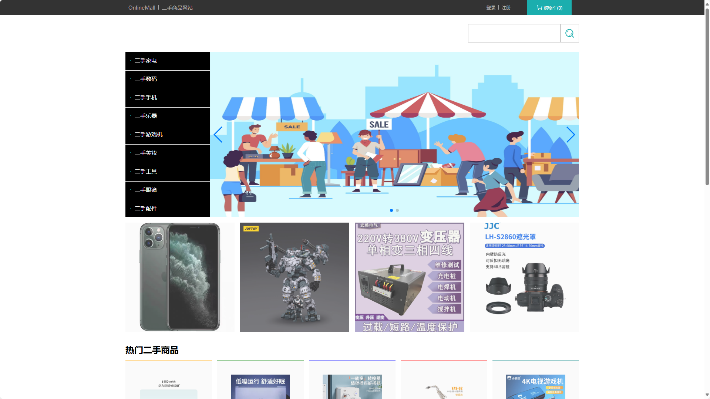

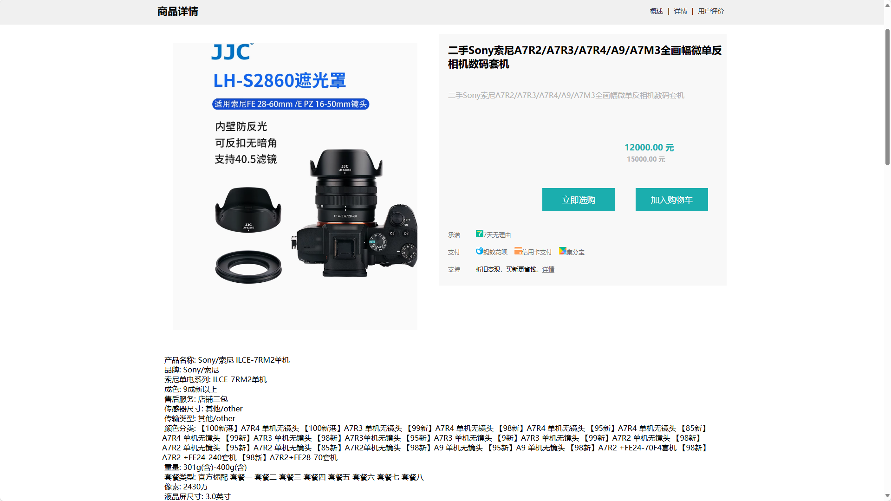
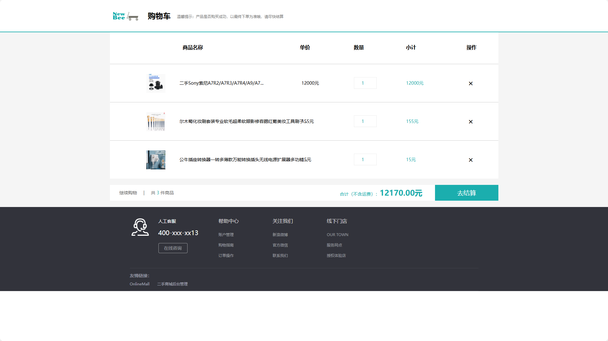
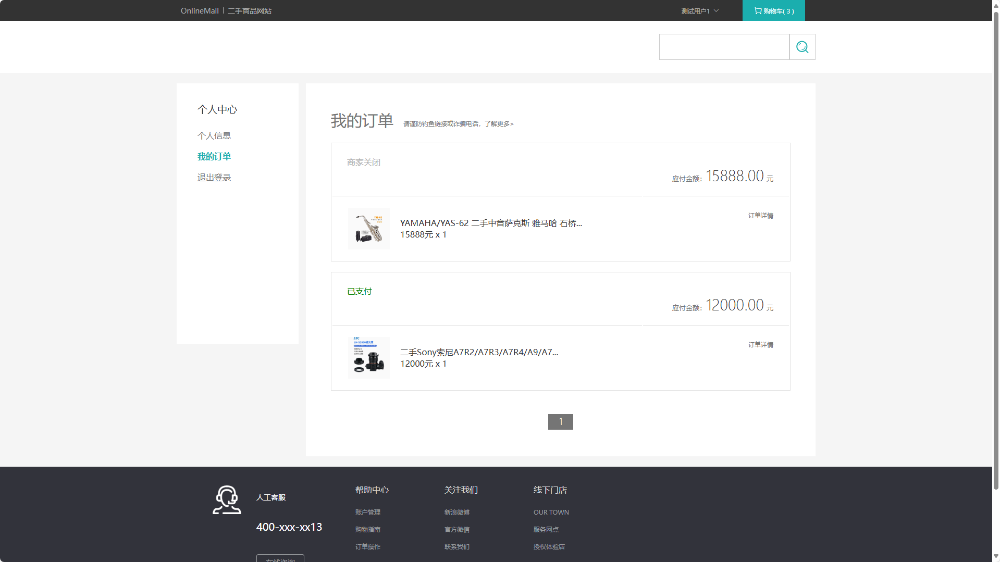
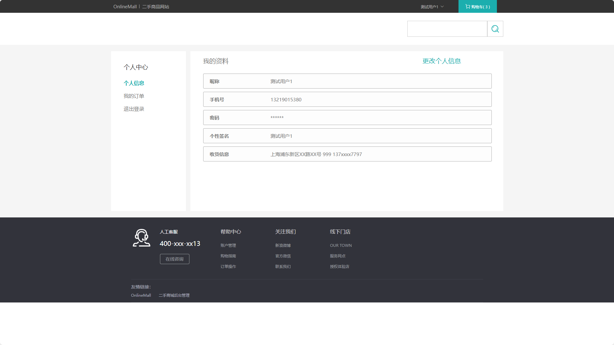
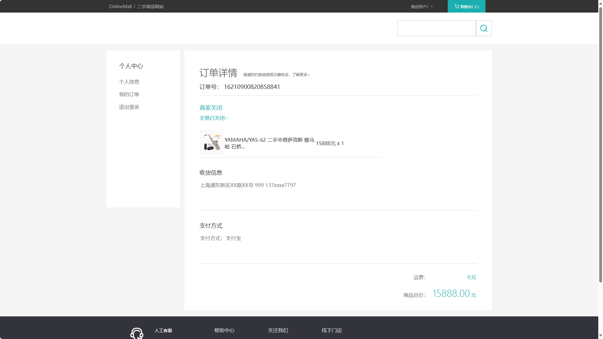

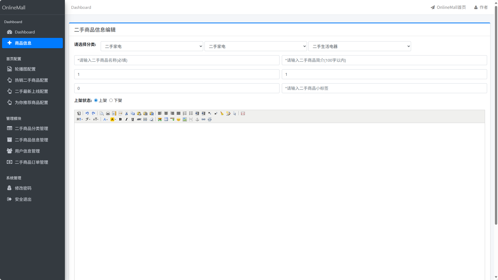
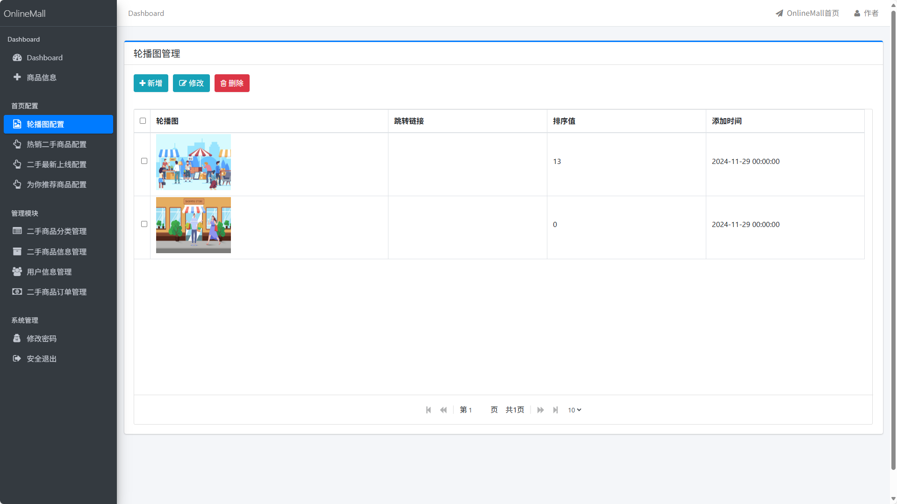
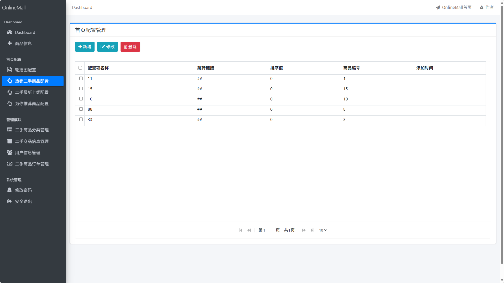
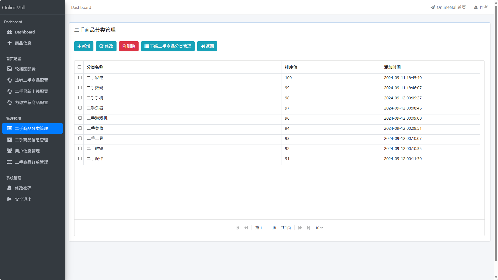
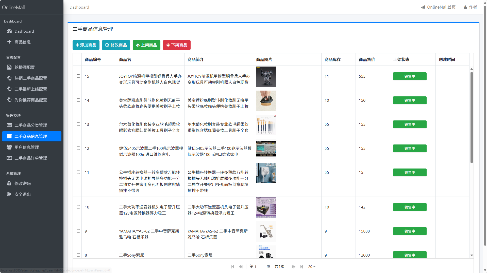
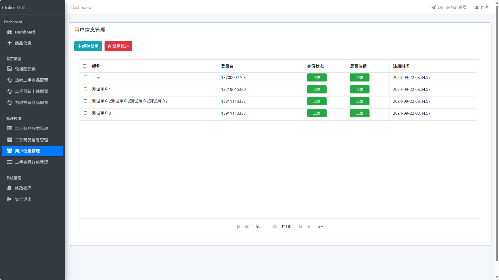
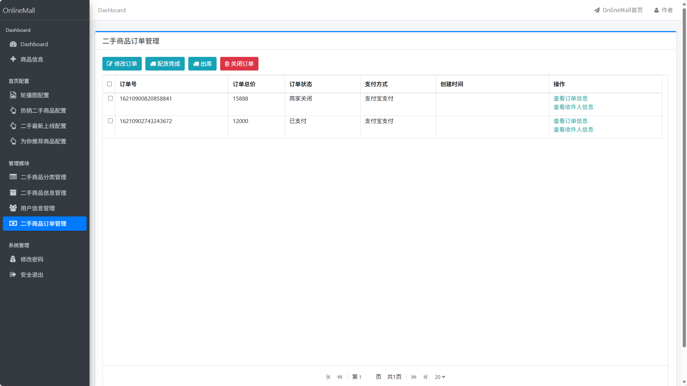

### 环境需求(可免费提供)
- idea/eclipse、jdk-1.8、maven-3.8.6、mysql、node.js等

## 有项目修改、安装调试需求 请联系以下

## 获取资源扫☝☝☝

